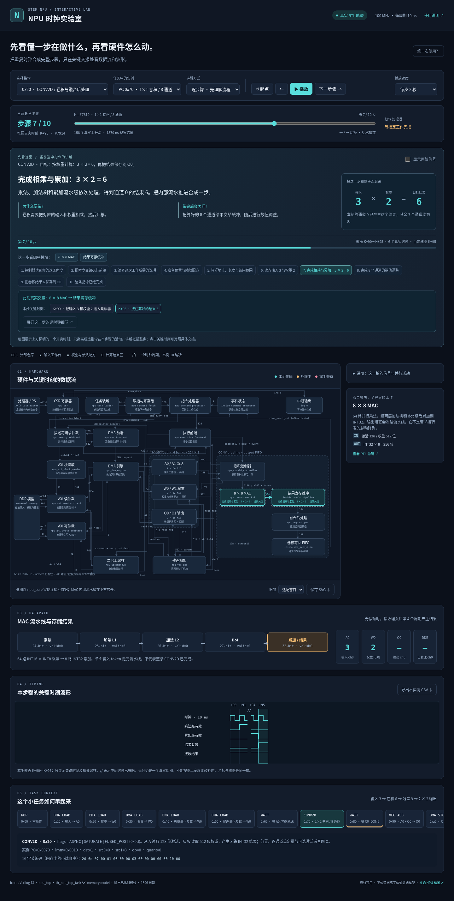

# NPU 时钟实验室

基于本仓库 RTL 的教学网页：选择指令，逐步骤理解流程，查看关键时刻的硬件模块、数据流、波形和计算结果。当前提供 **8 条已实现指令、14 个指令实例、1,596 个真实时钟周期**。

默认使用 **逐步骤**：**这一步做什么 → 为什么要做 → 做完后会怎样**。读取说明、计算地址、多次数据传输和逐通道处理分别合成完整步骤。每步标出真实时钟范围，框图固定在一个真实关键时刻，只高亮所选指令在这一步的活动。



## 打开页面

**最方便的方式：下载 [npu-lab.html](https://raw.githubusercontent.com/ziyan2006/NPU/work/teaching/npu-lab.html)，保存为 `.html` 文件，然后用浏览器打开。** 如果链接显示源码，可以右键链接选择“另存为”。这个单文件包含全部样式、脚本与轨迹，演示本身不需要联网。

已经下载仓库时，也可以打开本目录的 `index.html`。需要通过本地 HTTP 访问时，在仓库根目录执行：

```bash
python -m http.server 8000
```

然后访问 <http://localhost:8000/teaching/>。GitHub 的文件预览只显示源码，不会运行网页。

## 建议的学习顺序

1. 默认选择 `CONV2D`，先看顶部讲解与 `3 × 2 = 6` 的例子，再按“下一步骤”。本例卷积从接收命令到完成分为 10 步。
2. 选择 `DMA_LOAD` 的“输入 → A0”：442 个真实时钟合成 8 步，包括接收命令、交给前端、读齐说明、算好地址、清零、发起读取、搬入数据、完成。其中 368 个地址计算时钟只占一个教学步骤。
3. 查看“权重 → W0”，419 个接单等待时钟合为一步；再看 `WAIT` 的完成指示灯、`VEC_ADD` 的 `6 + 3 = 9`、`UPSAMPLE2X` 分两行写出四个像素。
4. 每一步都可点击“本步关键时刻”，框图与波形光标一起切换。波形只保留关键时刻及相邻真实采样，`//` 表示中间时钟已省略；各列时间间隔不一定相等，不能通过画面宽度比较耗时。
5. 想研究具体流水级、乘法轮次或并行取指活动时，点击“展开这一步的逐时钟细节”，或在“讲解方式”中选择“逐时钟”。这会恢复完整周期时间轴和全部并行活动。

点击模块可查看用途、接口宽度和 RTL 源码。逐步骤默认显示关键波形；“显示原始信号”展开进阶解释。逐时钟模式勾选后显示连续的 16 / 32 / 64 周期波形窗口。可导出当前框图 SVG 和所选实例的完整原始 CSV，导出不会删掉折叠的周期。

键盘：左右箭头按当前模式切换步骤或时钟，空格播放 / 暂停，`N` 前进到下一步讲解。逐步骤播放每步 4 / 2 / 1 秒，逐时钟播放每秒 2 / 8 / 30 周期。切换模式保留当前步骤或时刻，时间轴始终标出真实时钟范围。

“输入 → A0”的 LOAD 共记录 442 个上升沿，其中地址计算 368 拍包含 20 次乘法；每次 16 轮移位相加，加上启动与结果交接占 18 拍。逐时钟模式仍展示真实操作数，例如 `8 × 2` 字节和当前 `5 / 16` 轮。

## 演示任务与支持指令

张量采用 NHWC8，每个像素 8 通道；激活以 INT16 容器保存 INT12。输入通道 0 为 3，其余为 0。1×1 卷积仅 `weight[0,0]=2`，其余权重和偏置为 0，量化比例为 1，无激活。卷积结果通道 0 为 6；加上输入残差后为 9；写回 DDR 并上采样得到 2×2 的四个像素，每个都是 `[9,0,0,0,0,0,0,0]`。

| 指令 | opcode | 行为 |
|---|---|---|
| NOP | `0x00` | 直接退休 |
| WAIT | `0x01` | 等待全部指定事件，不清除事件 |
| END | `0x03` | 等所有单元空闲，结束任务 |
| DMA_LOAD | `0x10` | 异步 DDR → A / W |
| DMA_STORE | `0x11` | 异步 O → DDR，等待 AXI B 响应 |
| CONV2D | `0x20` | 异步卷积与融合后处理 → O |
| VEC_ADD | `0x30` | 同步残差重定量、饱和相加 |
| UPSAMPLE2X | `0x42` | 同步 DDR → 行缓冲 → DDR |

`ACT` 和 `REQUANT` 虽然能通过 CP 的 opcode 解码，当前执行前端没有独立实现，不能作为支持指令展示。激活与重定量通过卷积的融合后处理实现。枚举中的其他预留指令也未加入选择器。

完整任务：`NOP → 5×DMA_LOAD → WAIT(A0_READY|W0_READY) → CONV2D → WAIT(C0_DONE) → VEC_ADD → DMA_STORE → WAIT(S0_DONE) → UPSAMPLE2X → END`。

## 周期与高亮的含义

- 所有信号在**上升沿前**采样。`VALID=1 && READY=1` 表示数据在当前上升沿被接收，青色路径只标记这个沿实际发生的传输；逐步骤模式进一步筛选为当前步骤相关的路径。
- 橙色模块表示仍在处理；粉色虚线表示 `VALID=1 && READY=0`。灰色有效数据不代表本沿发生传输。
- `K+0` 是所选指令被 CP 接收的沿。绝对周期从复位释放后的第一个上升沿开始计数，包含前面的 CSR 配置和任务装载。
- 每个实例保留完整小任务的上下文。异步指令派发后，取指、下一条 DMA 或 WAIT 可以同时出现。没有重排、补造或删除等待周期。
- 通俗讲解优先追踪所选命令。DMA 前端与引擎的命令 tag 区分前后任务，避免把“前一条 LOAD 还在计算地址”误讲成“当前 LOAD 已经开始搬运”。白色虚框指出该关注的模块；逐步骤模式只显示该步相关的真实传输与忙碌状态，逐时钟模式显示所有并行活动。
- 地址乘法的操作数、忙碌状态、16 轮步骤与结果直接采自 RTL。进度来自固定录制，不预测其他任务或真实 DDR 的等待时间。
- 上采样示意图在完整像素的两个 8 字节数据块都被接收后，才将对应格子标为已写出；写事务仍需内存确认。
- A0 / W0 / O0 数值显示截至当前沿已观察到的通道 0 数据；DDR 栏显示已经握手发送的通道 0。其余 7 通道在本例均为 0。
- MAC valid 显示进入当前沿前的寄存器状态。无停顿时，输入在 K 沿接收，K+4 沿产生结果，因此上升沿前采样在 K+5 才看到 result_valid。后处理、写回与事件到达还有后续周期。

轨迹来自 `npu_top` 与仓库已有的 `tb_npu_top_task.sv` AXI 内存模型。**这里的延迟是这个固定仿真任务和内存模型的结果，不能直接当作实板 DDR 延迟或整模型性能。** 页面是记录回放，不支持在线改变张量尺寸或量化参数后重新仿真。

教学框图保留了 [NPU 原始内部框图](../框图/03_npu_internal_io.md) 的模块与接口关系，并展开了部分内部寄存缓冲。事件寄存器属于 CP，结果缓冲属于 CONV pipeline，写回 FIFO 属于 DMA subsystem；这些在图中单列是为了教学。AXI 固定 ID / PROT 等旁带字段未逐一展开，完整 59 个顶层端口见原框图的 I/O 表。

## 重新生成与验证

运行页面不需要安装工具。重新生成轨迹需要 Python 3 和 Icarus Verilog 13；浏览器验证需要 Python Playwright 和 Chromium。

```bash
python teaching/generate_trace.py
python teaching/build_offline.py
python teaching/check_page.py
```

`generate_trace.py` 创建临时小任务，使用已有 RTL 文件清单与完整任务 testbench，验证 14 条指令退休、正常完成与最终 DDR 输出后才写入 `trace.js`。Icarus 无法直接处理源码中的 7 处 enum 三目赋值，脚本只在临时副本中改写为等价 `if/else`，不修改仓库 RTL。源文件 SHA-256、信号层级路径、状态枚举和采样定义均保存在轨迹文件中。

若使用解包的 Icarus，可传入 `--iverilog`、`--vvp` 与 `--ivl-base`；`--keep` 可保留仿真文件供检查。修改 `index.html`、`style.css`、`app.js`、`lesson.js` 或 `trace.js` 后，应重新运行 `build_offline.py` 更新单文件版本。

`lesson.js` 将实际状态映射为通俗解释；每个实例的全部时钟都保留“行动、原因、下一步”三项。浏览器检查覆盖全部 14 个实例的步骤遍历、连续周期覆盖、关键时刻筛选、省略波形、长地址计算、前端接单等待、指示灯、四像素复制以及模式切换。发布时可以直接使用已经包含全部资源的 `npu-lab.html`。
