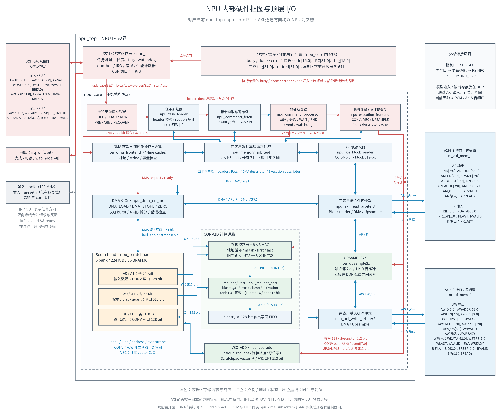
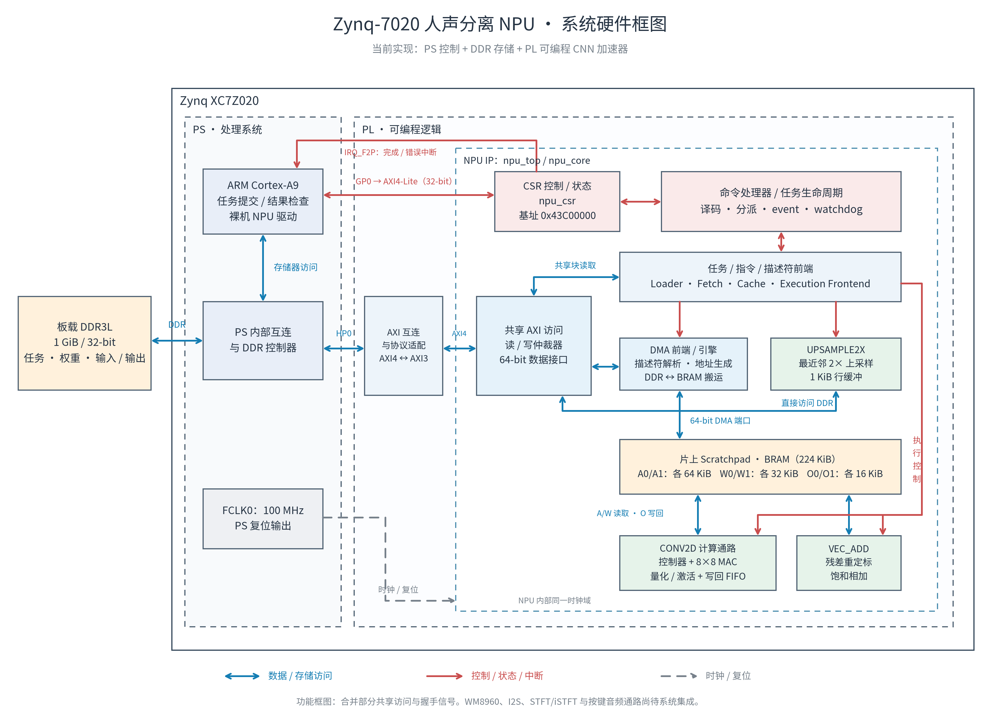
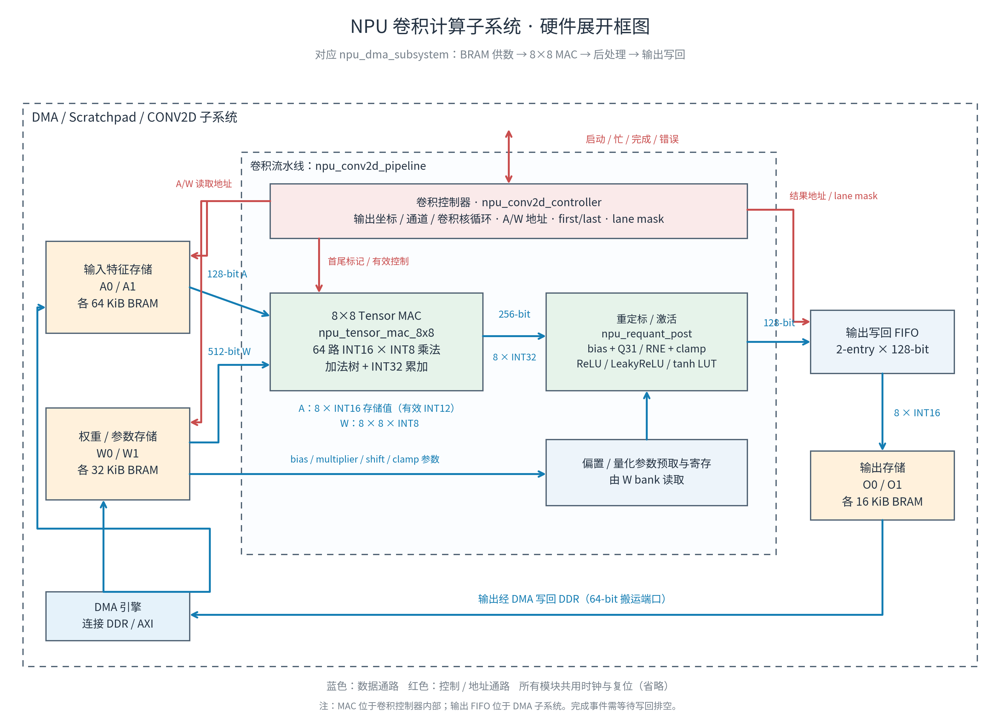

# 项目硬件框图

本目录的三张图依据当前 RTL 和 Zynq 集成脚本绘制，描述已实现的 NPU 系统。

| 图 | 用途 |
|---|---|
| [NPU 内部硬件框图与 I/O](03_npu_internal_io.md) | 聚焦 NPU 内部：完整模块连接、外部接口方向、关键位宽、59 个顶层端口表 |
| [系统硬件总框图](01_system_hardware.png) | PS、板载 DDR3L、AXI 控制/数据连接、PL 内部 NPU 模块 |
| [卷积单元展开框图](02_conv_hardware.png) | A/W/O BRAM、卷积控制器、8×8 MAC、参数预取、重定标/激活、写回 FIFO |

每张图提供 PNG、SVG、PDF 和 diagrams.net 可编辑的 `.drawio` 文件。
PNG 适合直接插入报告；SVG/PDF 适合放大和打印；`.drawio` 可在
<https://app.diagrams.net/> 中通过“文件 → 打开”编辑。

## NPU 内部硬件框图与 I/O



[完整 I/O 表与内部接口说明](03_npu_internal_io.md) · [SVG 矢量图](03_npu_internal_io.svg) · [PDF](03_npu_internal_io.pdf) · [drawio 可编辑文件](03_npu_internal_io.drawio)

## 系统硬件总框图



[SVG 矢量图](01_system_hardware.svg) · [PDF](01_system_hardware.pdf) · [drawio 可编辑文件](01_system_hardware.drawio)

## 卷积单元展开框图



[SVG 矢量图](02_conv_hardware.svg) · [PDF](02_conv_hardware.pdf) · [drawio 可编辑文件](02_conv_hardware.drawio)

蓝色表示数据或存储访问连接；红色表示控制、地址、状态或中断连接；灰色虚线表示时钟和复位。
双向箭头表示两个方向的访问或反馈，不代表该接口每周期均同时传输。

## 范围和读图说明

- 图是功能层次框图，并非 RTL 的逐端口连线图；握手、错误反馈和部分共享访问连接被合并。
- 系统图的“任务 / 指令 / 描述符前端”合并 task loader、command fetch、descriptor cache
  和 execution frontend；共享块读取还经过 `npu_memory_arbiter4` 与 `npu_axi_block_reader`。
- `npu_dma_subsystem` 内包含 DMA 前端/引擎、Scratchpad、CONV2D 流水线与输出 FIFO；
  总图按功能展开这些组件，没有逐一画出其 RTL 包装层。
- 卷积展开图把 MAC 独立画出以便解释数据通路；RTL 中 MAC 实例位于
  `npu_conv2d_controller` 内部。图中的 FIFO 位于 `npu_dma_subsystem` 内、卷积流水线外。
- INT12 是激活的有效量化精度，A/O bank 的实际存储值为 16 bit。
  MAC 使用 INT16×INT8 乘法与 INT32 累加。
- 224 KiB 是六个 A/W/O bank 的总容量，不包括 tanh LUT、上采样行缓冲等其他存储。
- 系统图中 1 GiB / 32-bit 来自板卡记录，只描述板载 DDR 配置，不表示全容量已通过验收。
- NPU 运行在 FCLK0 100 MHz。PL AXI4 数据口通过互连/协议适配访问 PS HP0 AXI3；
  HP0 非缓存一致性，PS 软件需按平台要求维护缓存。
- WM8960、I2S、STFT/iSTFT 和按键音频通路尚待系统集成，不作为已实现模块纳入本图。

## 依据

- `hardware/rtl/npu_top.sv`：CSR、core、AXI4-Lite、AXI4 与 IRQ 顶层边界。
- `hardware/rtl/npu_core.sv`：各执行单元、指令前端及共享内存仲裁的实际连接。
- `hardware/rtl/npu_dma_subsystem.sv`：DMA、Scratchpad、卷积流水线和写回 FIFO。
- `hardware/rtl/npu_conv2d_pipeline.sv`：A/W 读取、参数预取、卷积和后处理。
- `hardware/rtl/npu_conv2d_controller.sv`：循环、地址、lane mask 和 MAC 实例。
- `hardware/rtl/npu_tensor_mac_8x8.sv`：输入输出位宽及乘加流水线。
- `scripts/39_create_reference_zynq_soc.tcl`：GP0、HP0、IRQ、100 MHz FCLK 和 CSR 地址。
- `hardware/boards/alientek_navigator_z7020/README.md`：板卡 DDR 配置和最新集成状态。

## 重新生成

当前环境使用 matplotlib 和 Noto Sans CJK 字体。修改生成脚本中的方框和连接坐标后运行：

```sh
python 框图/render_hardware_diagrams.py
python 框图/render_npu_internal.py
```
